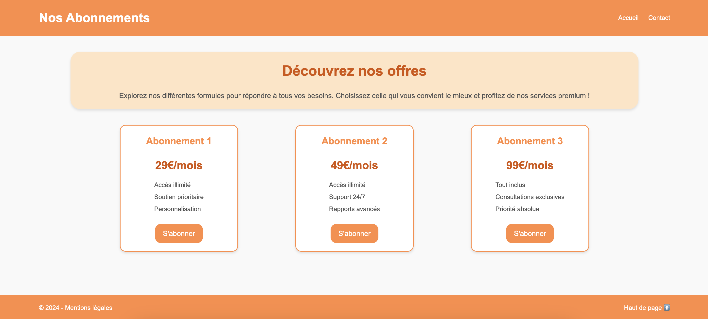

# Jour 11 :

## Challenge : "_Flying keyboard_" (short)

Repoduisez la page web ci-dessous en HTML et CSS en groupe, tour par tour, sans communiquer !

### Consignes

- Des **groupes de 4 membres** vont être annoncés par le formateur.

- **Aucune communication entre les membres du groupe** (parole, signes, etc...).

- Le **temps total** pour réaliser cet exercice est de **60 minutes** ; soit 15 minutes par membre.

- **Tour part tour** :

  - chaque membre a **3 minutes** pour coder avant de passer l'ordinateur au membre suivant, dans l'ordre des aiguilles d'une montre
  - vous n'avez le droit qu'à un seul ordinateur par groupe (sauf indication contraire par le formateur)

- Une fois la page terminée ou le temps écoulée : compressez le dossier avec le code et envoyez le dossier au formateur, par message privé sur Discord ... ou lancez-vous sur le [bonus](#bonus) !

### Conseils

- Les commentaires dans le code sont autorisés
- Pas d'autre ordinateur que celui du groupe
- Pas de téléphones portables pendant le codage ou l'attente
- **Il n'est pas nécessaire d'avoir un rendu au "pixel près", idem pour le texte et les couleurs**

### Bonus

> Si vous et votre groupe pensez que votre code est complet, propre et juste. **Posez-vous la question par commentaires dans le code** !

- Mettez à jour votre code, de manière à ce qu'il soit responsive pour téléphones portables (mobile) :
  - les deux liens de la navbar ("Accueil" et "Contact") doivent être alignés verticalement, sous le titre de la navbar
  - les trois cards doivent être alignées verticalement
  - le contenu du footer doivent être alignés verticalement ; le "Haut de page" dessus puis les mentions légales dessous
- Ajoutez des transitions sur les hover des boutons, des cards et des liens :
  - changez les couleurs de fond et/ou les couleurs de texte
  - ajoutez des ombres aux cadres
