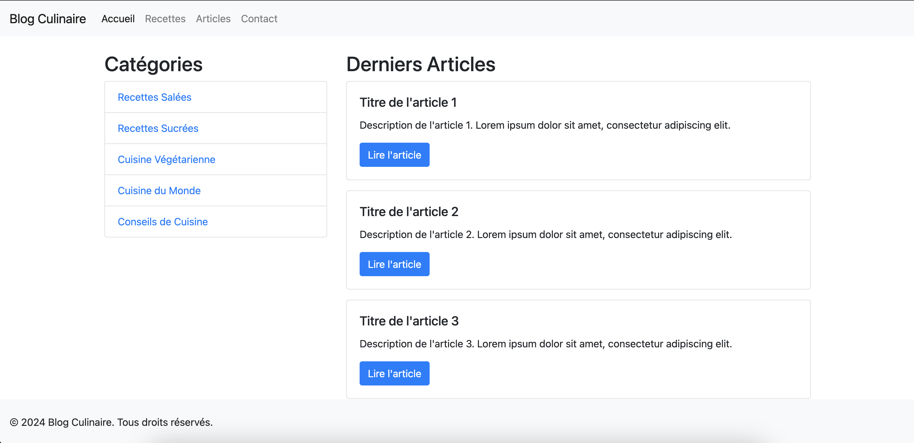
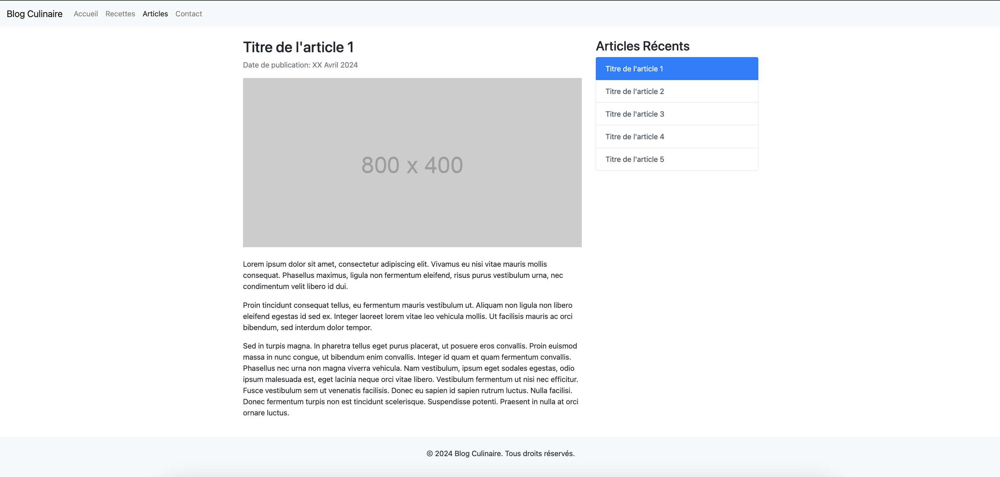

# Jour 12 : Révisions - Frameworks

##  Blog culinaire avec MaterializeCSS

Reproduisez ce site web ([en bas de ce fichier](#images)) avec **seulement MaterializeCSS** pour l'ajout de style et reliez les pages entre-elles.

### Consigne

La reproduction n'a pas a être parfaite, mais voici l'idée générale du site :

- une page d'accueil avec :
  - une navbar :
    - le bouton "Accueil" doit ramener à la page d'accueil
    - le bouton "Recettes" ne doit amener à aucune page
    - le bouton "Articles" doit ramener à la page du premier article
    - le bouton "Contact" ne doit amener à aucune page
  - une liste "Recettes" à gauche qui ne amener à aucune page
  - quelques articles à droite, dont chaque bouton amènera à sa page dédiée (eg. "article-1.html", "article-2.html", etc...)
  - un footer
- au moins une (1) page d'article avec :
  - une liste de liens à droite pour naviguer d'un article à un autre
  - les articles peuvent être identiques en contenu, mais ils doivent chacun être reliés vers un fichier différent (eg. "article-1.html", "article-2.html", etc...)

### Conseils

Focalisez-vous sur la structure, puis le style. Ne cherchez pas à dupliquer vos pages d'articles si vous n'avez pas encore terminé une (1) page d'article modèle (qui servira à dupliquer sans avoir besoin de refaire la page).

Lorsqu'une page indique "ne doit amener à aucune page" : utilisez `href="#"` pour que le lien ait l'air fonctionnel.

Donnez des noms qui ont du sens à vos fichiers : par exemple, la page d'accueil devrait s'appeler "accueil.html" et avoir un header correct, en rapport avec cette page, notamment le titre de l'onglet qui devrait être "Site culinaire - Accueil".

### Bonus :

Une fois le site terminé, vous pouvez au choix :

- une page affichant toutes les recettes avec des cards

- refaire ce site avec un autre framework comme BootstrapCSS, TailwindCSS ou d'autres

---

### Images

#### Page d'accueil

#### Page d'article

