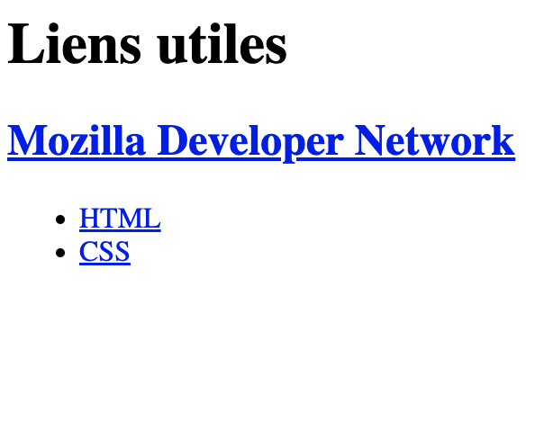

# Jour 2 : Links

## Exercice 1

- Dans ce dossier "exercice-1", ajoutez un fichier **index.html** et ajoutez dans l'ordre :
  - un grand titre avec le texte "Liens utiles"
  - un sous-titre avec le texte "Mozilla Developer Network" et faites en sorte que lorsqu'on cliquera sur cette phrase, on soit redirigé vers la page d'accueil de MDN (https://developer.mozilla.org/fr/)
  - une liste non-ordonnée avec ces éléments de listes :
    - le texte "HTML", qui est un lien pour aller vers l'URL https://developer.mozilla.org/fr/docs/Web/HTML
    - le texte "CSS", qui est un lien pour aller vers l'URL https://developer.mozilla.org/fr/docs/Web/CSS

### Conseils

- Codez petit-à-petit, en (re)lisant les consignes, sans vous presser

- Testez votre code directement sur Google Chrome pour vérifier qu'il fonctionne correctement
