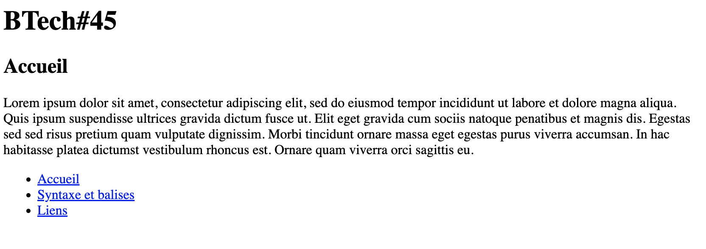

# Jour 2 : Links

## Exercice 2

Dans ce dossier "exercice-2", ajoutez un fichier **home.html**, un fichier **html-basics.html** et un fichier **links.html**

Dans chaque fichier, ajoutez :
  - un grand titre avec le texte "BTech#45"
  - un sous-titre selon le fichier :
    - dans le fichier "home.html" : "Accueil"
    - dans le fichier "html-basics.html" : "Jour 1 - Syntaxe et balises HTML"
    - dans le fichier "links.html" : "Jour 2 - Liens HTML"
  - un paragraphe au choix ; différent sur chaque page
  - une liste non-ordonnée de liens :
    - "Accueil" qui doit mener vers "home.html"
    - "Syntaxe et balises" qui doit mener vers "html-basics.html"
    - "Liens" qui doit mener vers "links.html"

### Conseils

- Codez petit-à-petit, en (re)lisant les consignes, sans vous presser

- Terminez d'abord une (1) page avant de faire les suivantes ; ce sera plus simple pour corriger une éventuelle erreur sur une (1) seule page plutôt que trois en même temps

- Testez votre code directement sur Google Chrome pour vérifier qu'il fonctionne correctement

- La capture d'écran montrant le résultat ne montre qu'une seule page pour l'exemple : vous devez bien en avoir trois de votre coté !
