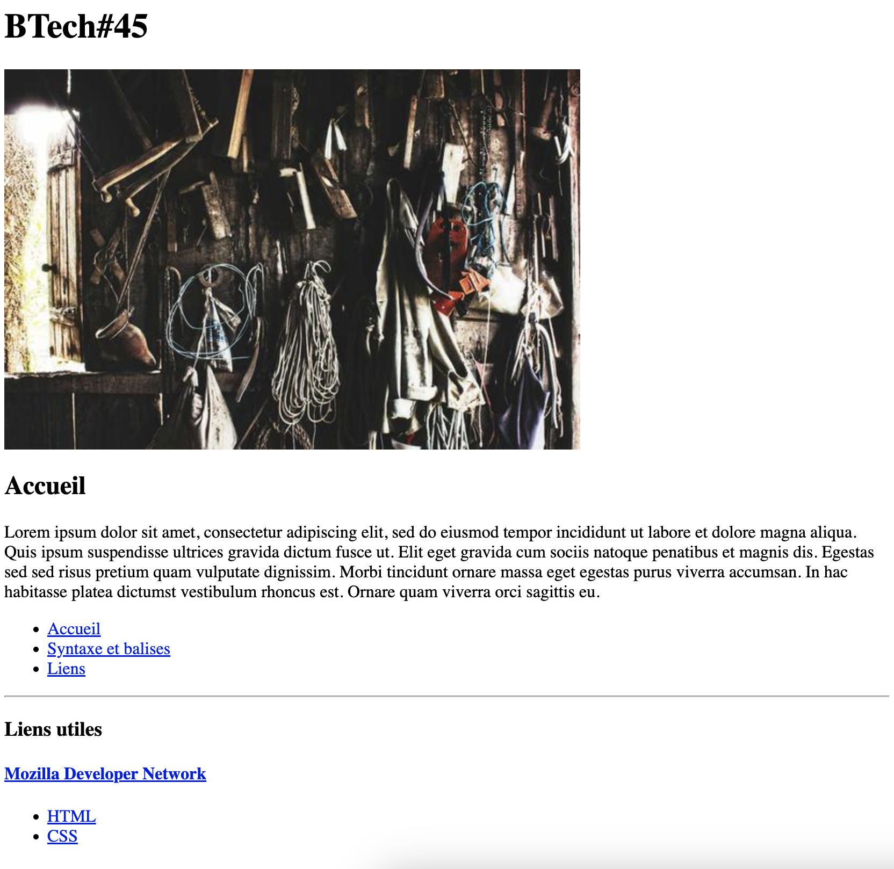

# Jour 2 : Links

## Exercice 3

Dans ce dossier "exercice-3", reprenez les fichiers de l'exercice 2 :
- **home.html**
- **html-basics.html**
- **links.html**

Dans chaque fichier, en plus de ce que vous avez fait pendant l'exercice 2, ajoutez :
  - l'image "picsum.png" entre le grand titre et le sous-titre
  - ajoutez après la liste de liens :
    - une ligne horizontale pour séparer
    - un sous-sous-titre "Liens utiles"
    - un sous-sous-sous-titre "Mozilla Developer Network" qui doit être un lien vers la page d'accueil de MDN (https://developer.mozilla.org/fr/)
    - la liste non-ordonnée de l'exercice-1 avec donc :
      - "HTML", pour être redirigé vers https://developer.mozilla.org/fr/docs/Web/HTML
      - "CSS", pour être redirigé vers https://developer.mozilla.org/fr/docs/Web/CSS

### Conseils

- Codez petit-à-petit, en (re)lisant les consignes, sans vous presser

- Terminez d'abord une (1) page avant de faire les suivantes ; ce sera plus simple pour corriger une éventuelle erreur sur une (1) seule page plutôt que trois en même temps

- Testez votre code directement sur Google Chrome pour vérifier qu'il fonctionne correctement

- La capture d'écran montrant le résultat ne montre qu'une seule page pour l'exemple : vous devez bien en avoir trois de votre coté !

- L'image provient du site [Lorem picsum](https://picsum.photos/) qui ne contient que des images libres de droit. Vous devriez l'indiquer dans l'attribut "alt" de votre image, ou donnez une description simple de l'image que l'on voit !

> On s'approche de plus en plus de la structure d'une vraie page web ! Vous verrez dans le prochain cours les bases du style, avec de quoi changer les couleurs, la police d'écriture, etc...
