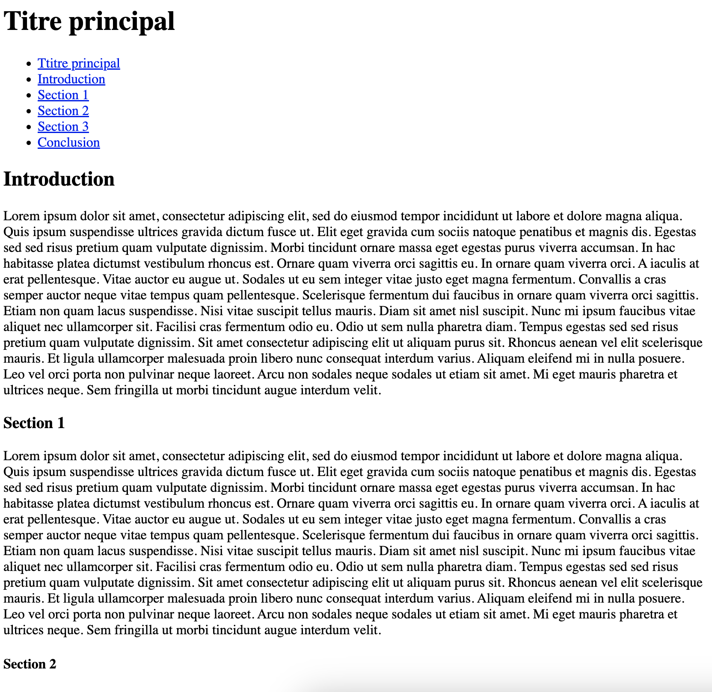

# Jour 2 : Links

## Exercice 4

Une pratique très courante pour naviguer *dans* une page est d'ajouter des liens *internes*. Checkez par exemple [cet article de Wikipédia](https://fr.wikipedia.org/wiki/Circuit_%C3%A9lectrique) et plus particulièrement le sommaire à gauche et la barre d'URL : lorsqu'on clique sur l'un des éléments de liste (qui est un lien), on ne va pas vers une autre page mais on reste bien sur la même !

La barre d'URL indique aussi quelque chose de particulier lorsqu'on clique sur l'un de ces liens.
Par exemple, en cliquant sur "[Topologie](https://fr.wikipedia.org/wiki/Circuit_%C3%A9lectrique#Topologie)", on obtient cette URL : https://fr.wikipedia.org/wiki/Circuit_%C3%A9lectrique#Topologie ← "#Topologie" est en fait un identifiant unique, associé au sous-titre "Topologie", qui permet de le retrouver plus facilement lorsqu'on voudra s'y rendre avec un lien.

Aidez-vous de [cet exemple sur la documentation de MDN](https://developer.mozilla.org/fr/docs/Web/HTML/Element/a#cr%C3%A9er_un_lien_vers_un_%C3%A9l%C3%A9ment_de_la_m%C3%AAme_page) pour faire de même !

### Consignes

Dans ce dossier "exercice-4", créez un fichier **index.html** avec :

- **6 titres**, de niveaux différents chacun :
  - "Titre principal" est un titre de niveau 1
  - "Introduction" est un titre de niveau 2
  - etc...
- en dessous de chaque titre, **un long paragraphe de texte** (en utilisant par exemple du faux texte)
- en haut de page, avant le premier titre, ajoutez une table des matières sous forme de **liste non-ordonnée**, permettant de naviguer vers chaque titres via des ancres (`<a>`)

### Conseils

- Codez petit-à-petit, en (re)lisant les consignes, sans vous presser

- Testez votre code directement sur Google Chrome pour vérifier qu'il fonctionne correctement

- Tout comme sur la capture d'écran, vous avez besoin de mettre beaucoup de texte pour pouvoir scroller (faire défiler) la page ; l'intérêt est que vous "verrez" le déplacement sur la page lorsque vous cliquerez sur l'un des liens

- Ce concept n'est pas simple ; demandez de l'aide si vous restez bloqués !
