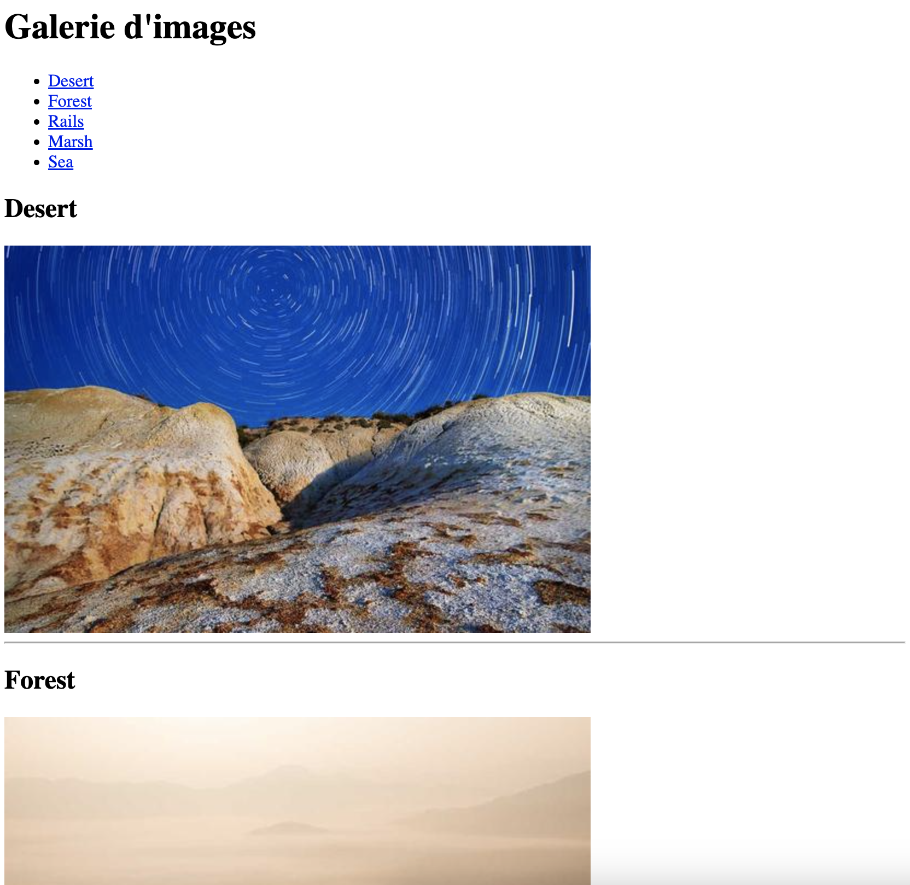

# Jour 2 : Links

## Exercice 5

Dans ce dossier "exercice-5", créez un fichier **index.html** et ajoutez :

- un titre principal affichant le texte "Galerie d'images"
- une liste non-ordonnée contenant les noms des images ("Desert", "Forest", etc...), où chaque élément est un lien menant directement à l'image correspondante
- affichez les cinq images du dossier (desert.png, forest.png, ...), chacune suivie d’une ligne horizontale
- ajoutez enfin tout en bas de la page un lien permettant de remonter en haut de la page

### Conseils

- L'ordre des images n'a pas d'importance, tant que vous gardez la bonne correspondance entre le nom et l'image ; l'image "desert.png" devra afficher le sous-titre "Desert".

- N'oubliez pas d'ajouter une valeur à "alt" ; le plus simple est de décrire ce que l'on voit sur l'image

- Pour remonter en haut de page, une pratique courante est de remonter jusqu'au premier élément de la page ; ici, il s'agit du titre principal

- Testez votre code directement sur Google Chrome pour vérifier qu'il fonctionne correctement
