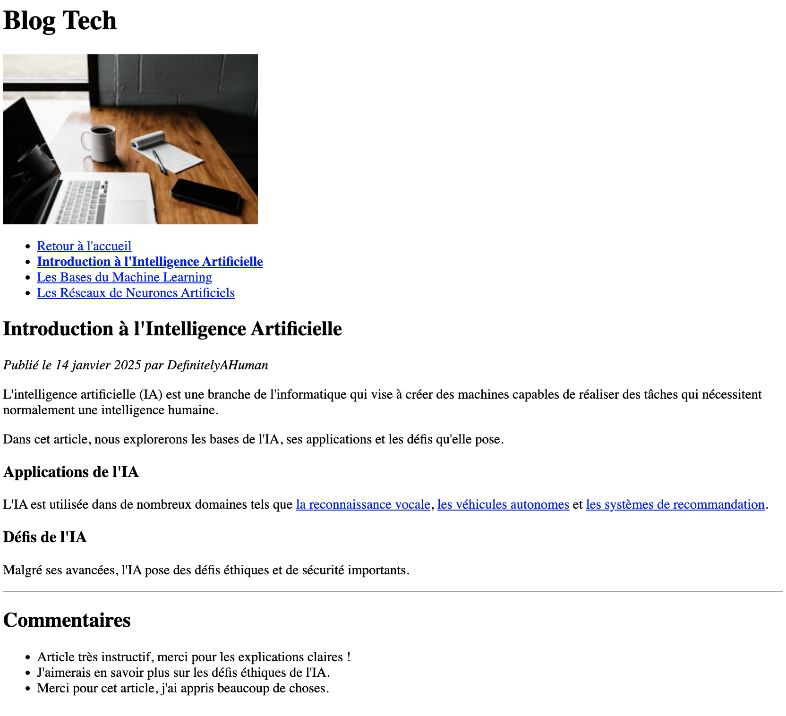

# Jour 2 : Links

## Exercice 6 bonus

Dans ce dossier "exercice-6-bonus, reprenez votre fichier **home.html** de l'exercice-6 et ajoutez au moins un fichier **article-1.html** et reproduisez la page ci-dessous :

### Conseils

- Les liens "Lire l'article" du fichier "home.html" doivent maintenant mener vers leurs pages respectives ! N'oubliez pas de remplacer la valeur "#" de vos attributs `href` par le nom du fichier correspondant !

- Les liens du menu de navigation ("Retour à l'accueil", "Introduction à l'Intelligence Artificielle", etc...) doivent mener vers leurs pages respectives.

- Inutile de recopier le texte parfaitement, mais respectez le bon nombre et le bon type de chaque balise

- Une fois la page du premier article terminée, à vous d'ajouter les autres pages d'articles !
