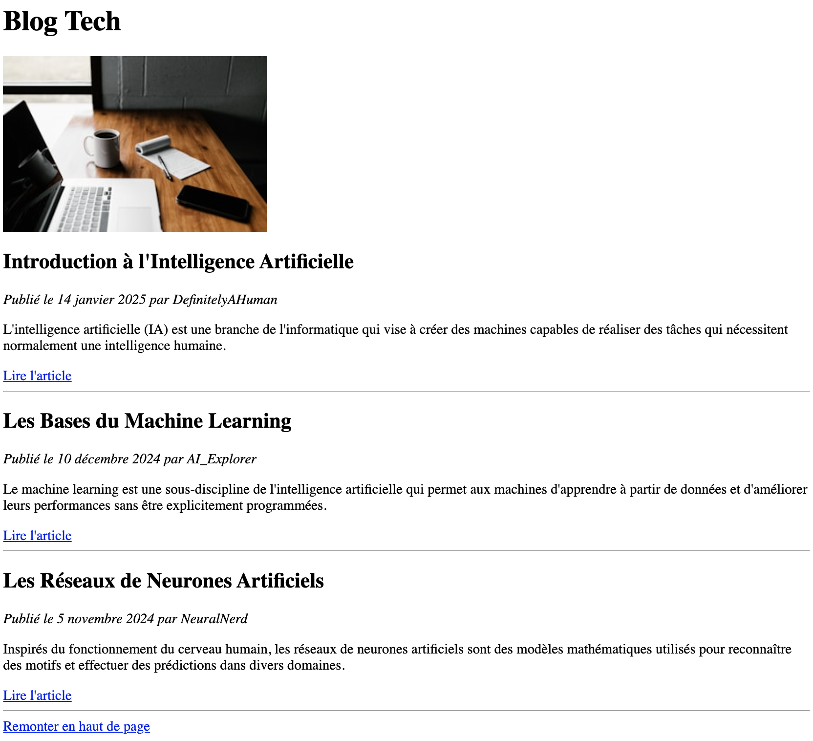

# Jour 2 : Links

## Exercice 6

Dans ce dossier "exercice-6", ajoutez un fichier **home.html** et reproduisez la capture d'écran ci-après :

### Conseils

- Les liens "Lire l'article" ne doivent mener nul part ! Vous pouvez mettre la valeur "#" dans l'attribut `href` : `<a href="#">Un lien</a>`

- Inutile de recopier le texte parfaitement, mais respectez le bon nombre et le bon type de chaque balise

- N'oubliez pas d'ajouter une valeur à "alt" à l'image ; le plus simple est de décrire ce que l'on voit dessus

- Testez votre code directement sur Google Chrome pour vérifier qu'il fonctionne correctement
