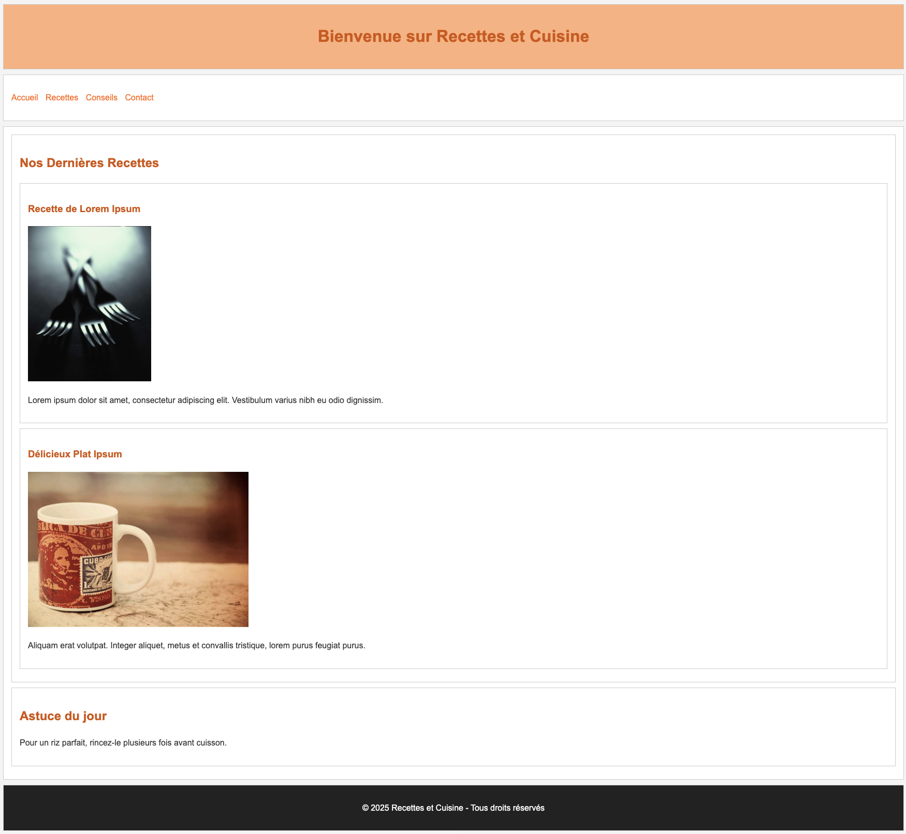

# Jour 3 : CSS basics

## Exercice bonus 2

> ⚠️ Cette exercice n'est a faire que si vous avez terminé et rendu les autres exercices ⚠️

Créez dans ce dossier "exercice-bonus-2" un fichier "index.html" et un fichier "styles.css" et reproduisez le résultat ci-dessous.

## Conseils

- Ne cherchez pas à reproduire à la perfection, mais essayez de vous approcher le plus possible du résultat. Par exemple, inutile de cherche la même couleur de fond que le titre principal, mais une couleur voisine fera l'affaire.
- N'oubliez pas :
  - le **boilerplate**
  - les **descriptions d'images**
  - le **titre du site** (dans l'onglet)
  - la **langue** du site
  - ajoutez aussi un **nom d'auteur** et des **mots-clés** dans les **méta-données**

## La suite

Si vous terminez cet exercice, et que vous en voulez plus : à vous de créer les autres pages ! Il vous reste à faire les pages :
  - Recettes
  - Conseils
  - Contact

Reprenez des éléments de style communs (vous pouvez aussi en changer d'une page à une autre, via plusieurs fichiers CSS).
